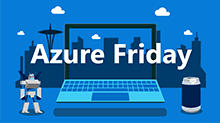

# Azure Friday - Azure Serverless on Kubernetes with KEDA

Demo used in Azure Friday on Azure Serverless on Kubernetes with KEDA episode.

## How to run the demo

1. Create an Azure Service Bus namespace with `orders` & `shipments` queues
2. Install KEDA in your Kubernetes cluster ([info](https://keda.sh/docs/2.0/deploy/))
3. Provide base64 encoded secrets in `deploy\deploy-app.yml` with your Service Bus connection strings for our app
4. Deploy the application with `kubectl apply -f deploy\deploy-app.yml`
5. Provide base64 encoded secrets in `deploy\deploy-autoscaling-orders.yml` with your Service Bus connection strings for our autoscaling
6. Deploy the application with `kubectl apply -f deploy\deploy-autoscaling-orders.yml` to autoscaling for our .NET Core Orders worker
7. Deploy the application with `kubectl apply -f deploy\deploy-autoscaling-shipments.yml` to autoscaling for our Azure Function shipments function

## License

This demo is shared under MIT license but is mainly a fork of [kedacore/sample-dotnet-worker-servicebus-queue](https://github.com/kedacore/sample-dotnet-worker-servicebus-queue) which provides a walkthrough to scale .NET Core workloads with KEDA and includes various Service Bus authentication examples.